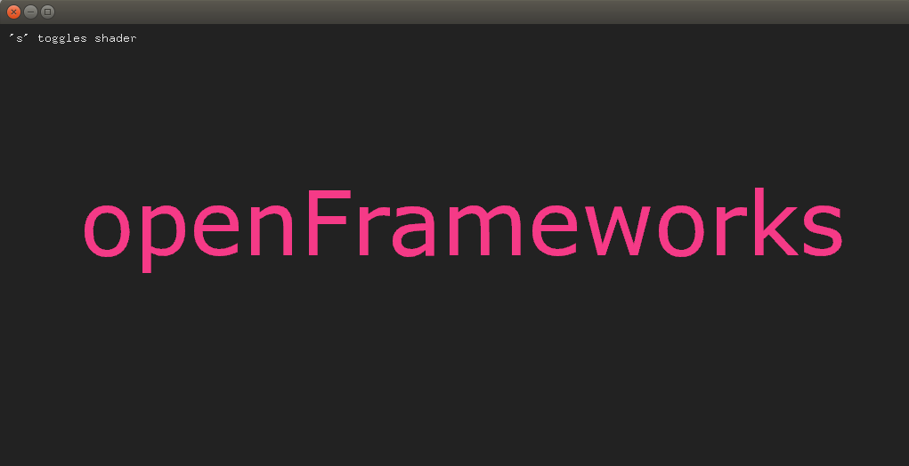

# openframeworks-cuda-docker
When you can't build openFrameworks on Ubuntu, docker is possibly the solution.

## requirement
nvidia-docker

## how to run openFrameworks example
just type the following commands on terminal. ($ -> local, \# -> docker)  
```
$ sudo docker pull ryokomy/openframeworks-cuda
$ xhost +
$ xhost local:
$ sudo nvidia-docker run -it -e DISPLAY=$DISPLAY -v /tmp/.X11-unix:/tmp/.X11-unix --privileged ryokomy/openframeworks-cuda bash

# cd /root/src/openFrameworks/examples/gl/shaderExample
# make
# make run
```


## environment in docker
- OS: Ubuntu14.04
- openFrameworks: 0.9.8
- Cuda: 8.0
- cudnn: 5
